# Create billing alarms to monitor the AWS charges.

## 1. Monitoring Overview
You can monitor your estimated AWS charges by using Amazon CloudWatch. When you enable the monitoring of estimated charges for your AWS account, the estimated charges are calculated and sent several times daily to CloudWatch as metric data.

Billing metric data is stored in the US East (N. Virginia) Region and represents worldwide charges. This data includes the estimated charges for every service in AWS that you use, in addition to the estimated overall total of your AWS charges.

The alarm triggers when your account billing exceeds the threshold you specify. It triggers only when actual billing exceeds the threshold. It doesn't use projections based on your usage so far in the month.

## 2. Lab - Billing Alarm
Before you can create an alarm for your estimated charges, you must enable billing alerts, so that you can monitor your estimated AWS charges and create an alarm using billing metric data. After you enable billing alerts, you can't disable data collection, but you can delete any billing alarms that you created.

After you enable billing alerts for the first time, it takes about 15 minutes before you can view billing data and set billing alarms.
### 2.1 Enabling Billing Alerts
Open the Billing and Cost Management console at Top menu->Your Account Name->My Billing Dashboard or directly visit https://console.aws.amazon.com/billing/. In the navigation pane, choose Billing Preferences.
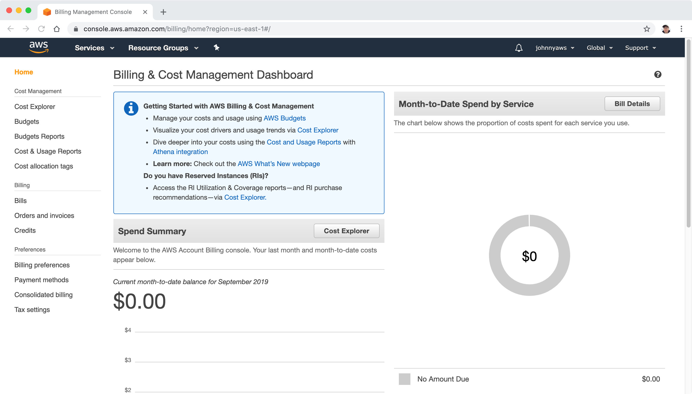
Choose Receive Billing Alerts, and Save preferences.
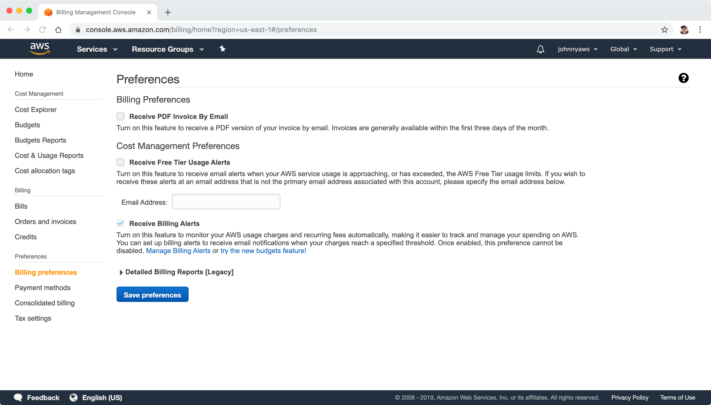

### 2.2 Creating a Billing Alarm
Open the CloudWatch console at Services->Management & Governance->CloudWatch, or directly visit https://console.aws.amazon.com/cloudwatch/. If necessary, change the Region to US East (N. Virginia). Billing metric data is stored in this Region and represents worldwide charges.
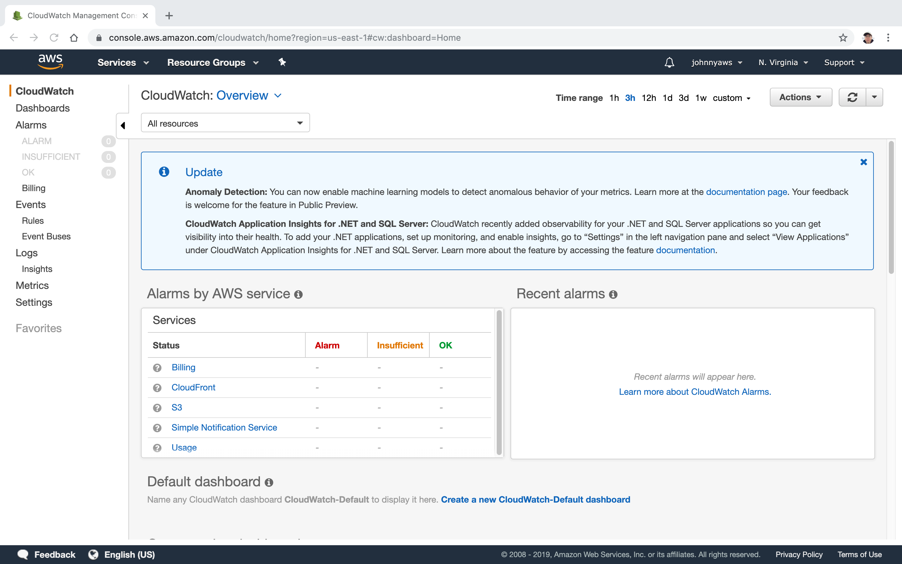
In the navigation pane, choose Alarms, then "Create alarm".
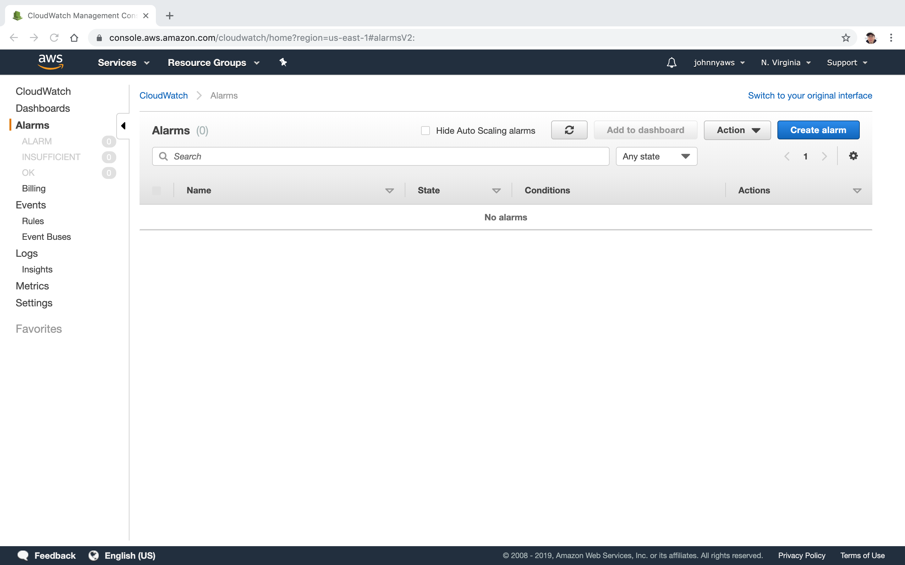
Click "Select metric".
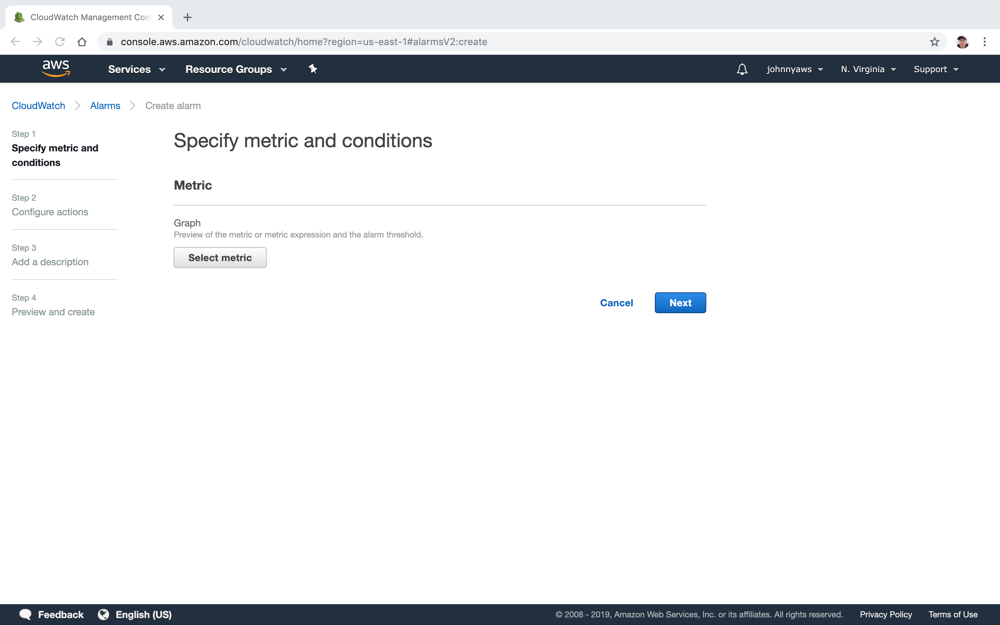
In the "All metrics" tab, choose "Billing", then "Total Estimated Charge".
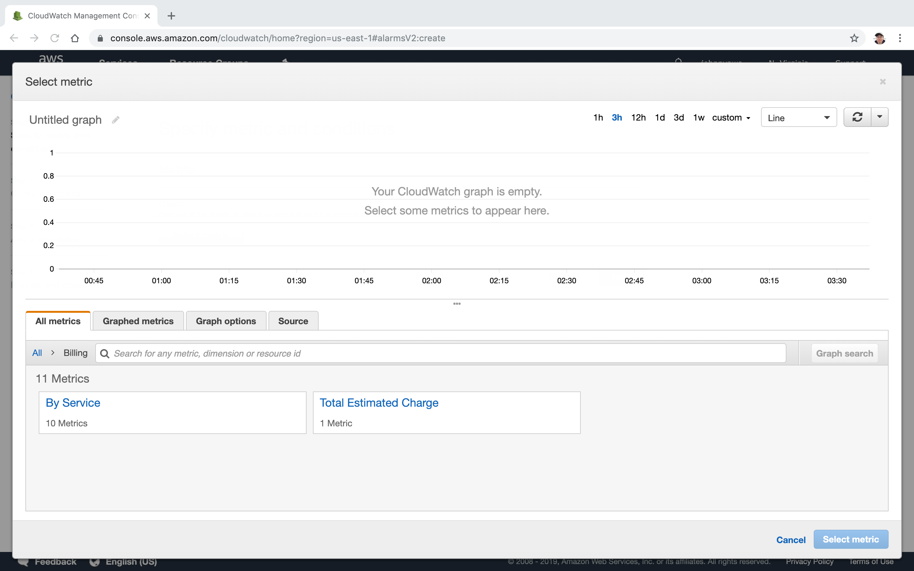
Select the check box next to Currency, then "Select metric".
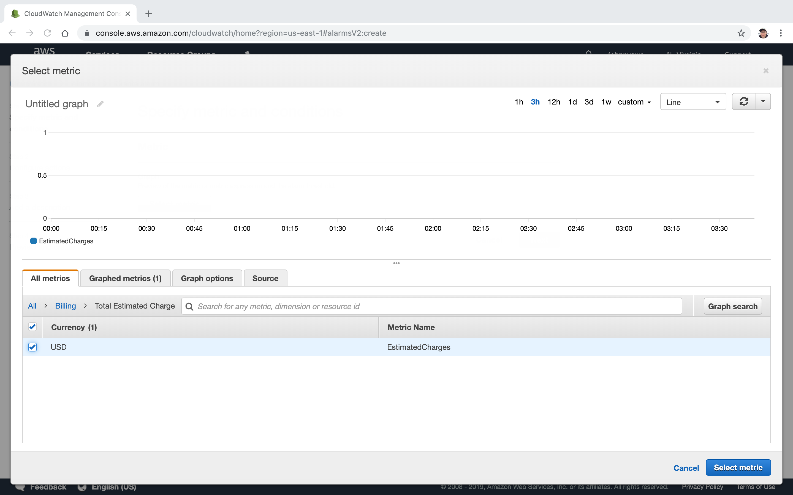
Under Conditions, choose "Static", set threshold, eg. Greater/Equal 10 USD, next.
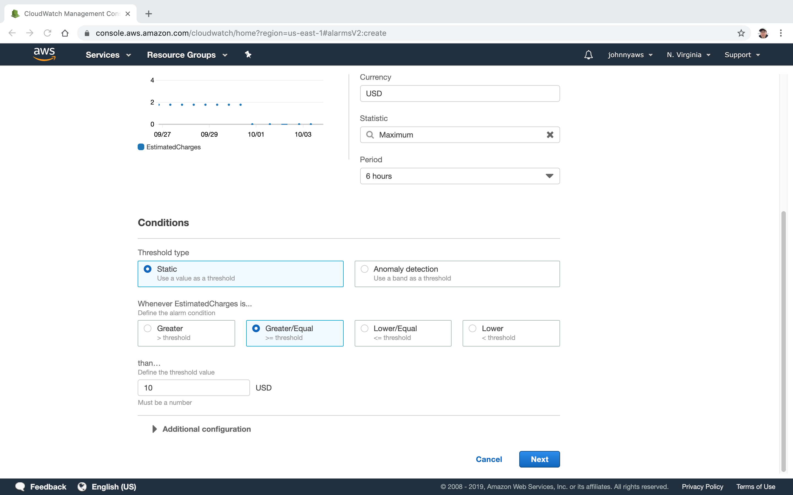
Choose "Create new topic", set topic name and provide email address to receive alarm, click "Create topic".
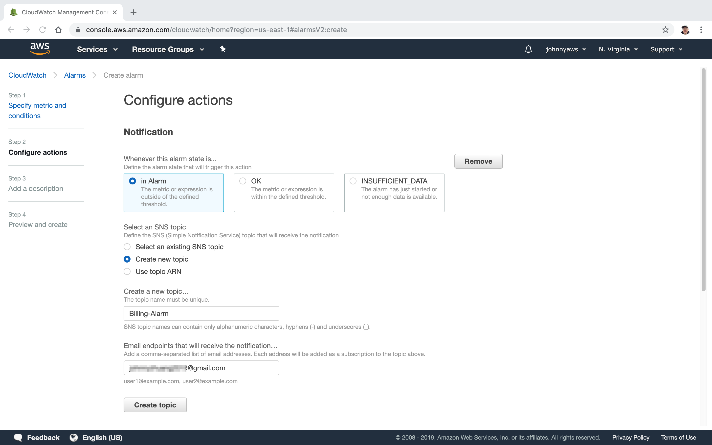
Topic is created, next.
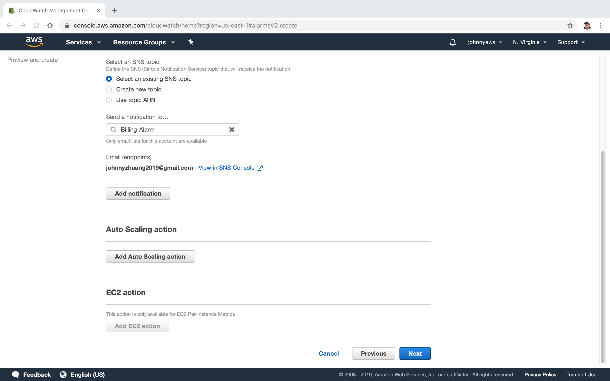
Set description, next.
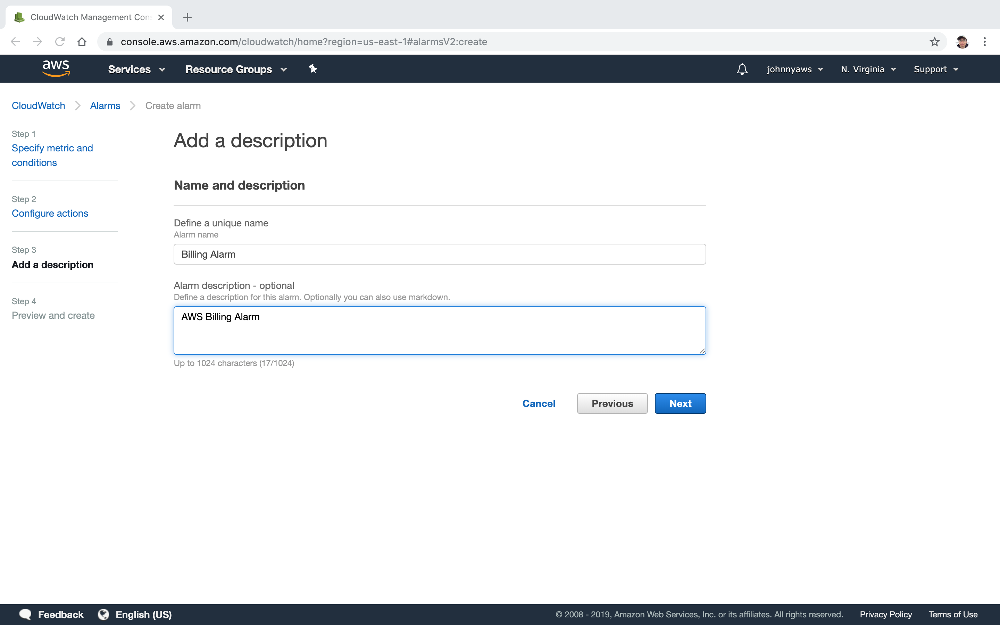
Preview, scroll to bottom, Create Alarm.
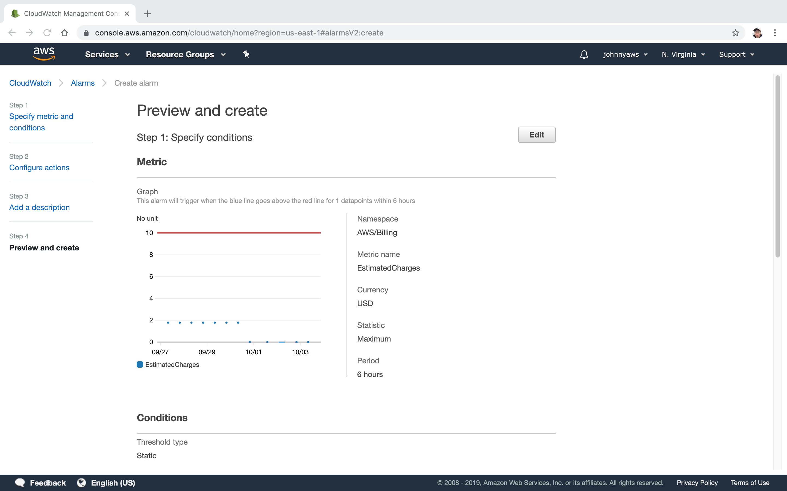
Alarm is created and in pending status.
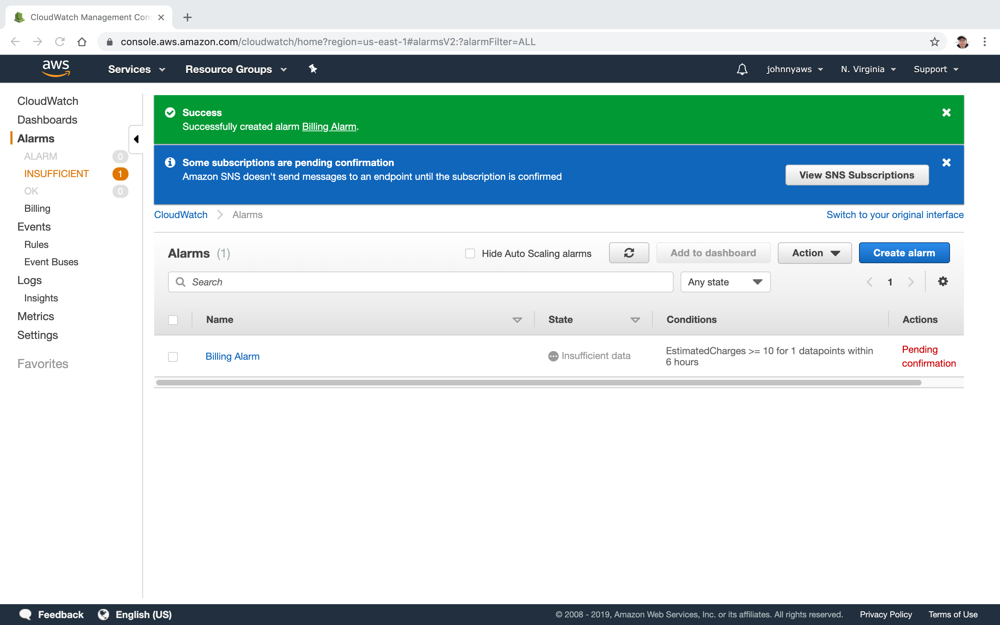
It will take few minutes until the state becomes to "OK".
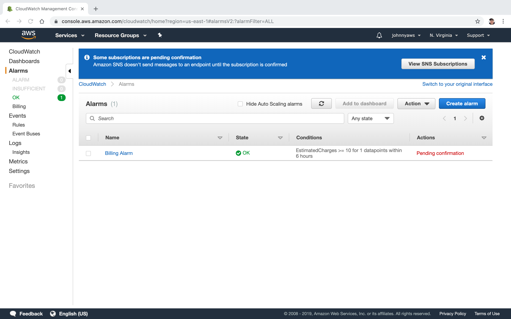
Later, if any charge occurs, you will receive an email notification, see below.
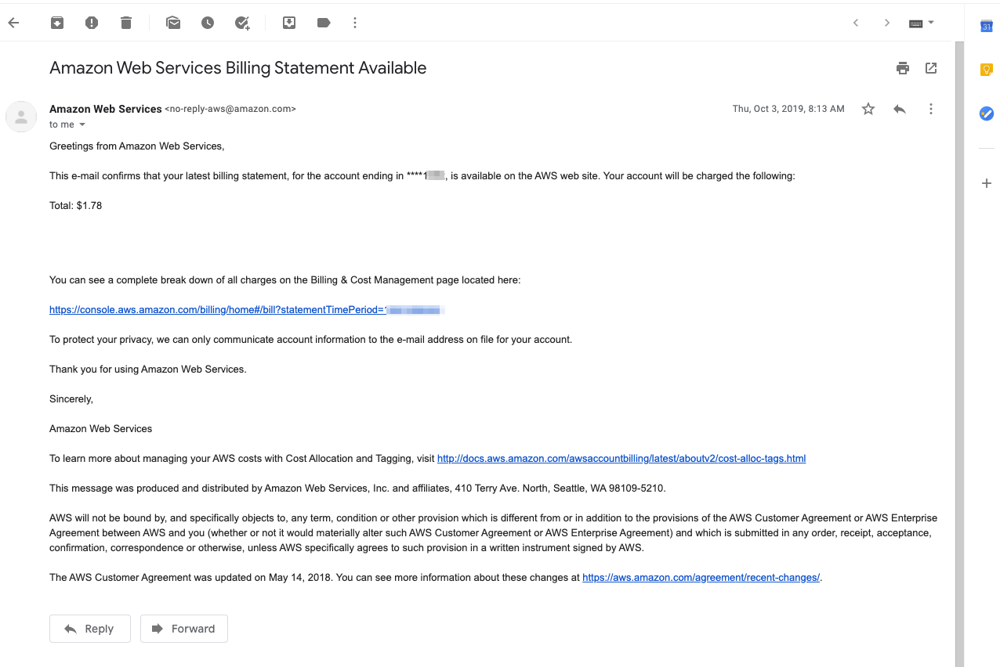

## 3. References
* [Creating a Billing Alarm to Monitor Your Estimated AWS Charges](https://docs.aws.amazon.com/AmazonCloudWatch/latest/monitoring/monitor_estimated_charges_with_cloudwatch.html)